<!--
  Profile README for github.com/ConorFogarty99
  Widths 370/490 keep the portrait and info card the same rendered height:
    avi-ascii.svg  is 840x875  -> at width 370 renders 385 tall
    info-card.svg  is 480x380  -> at width 490 renders 388 tall
  If you re-generate either SVG at a different size, re-match these.
  Regenerate with:  python scripts/make_ascii_svg.py  /  make_info_card.py
-->

<table>
<tr>
<td valign="top"></td>
<td valign="top"></td>
</tr>
</table>

